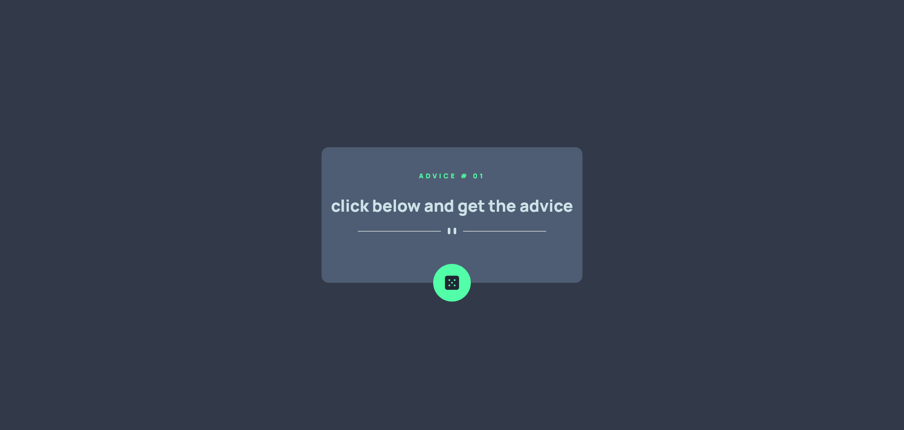
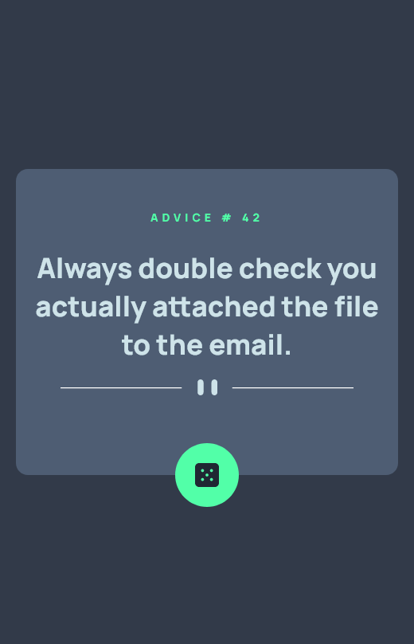

# Frontend Mentor - Advice generator app solution

This is a solution to the [Advice generator app challenge on Frontend Mentor](https://www.frontendmentor.io/challenges/advice-generator-app-QdUG-13db). Frontend Mentor challenges help you improve your coding skills by building realistic projects.

## Table of contents

- [Overview](#overview)
  - [The challenge](#the-challenge)
  - [Screenshot](#screenshot)
  - [Links](#links)
- [My process](#my-process)
  - [Built with](#built-with)
  - [What I learned](#what-i-learned)
  - [Continued development](#continued-development)
  - [Useful resources](#useful-resources)
- [Author](#author)
- [Acknowledgments](#acknowledgments)


## Overview

### The challenge

Users should be able to:

- View the optimal layout for the app depending on their device's screen size
- See hover states for all interactive elements on the page
- Generate a new piece of advice by clicking the dice icon

### Screenshot






### Links

- Live Site URL: [advice-generator-vwn0.onrender.com](https://advice-generator-vwn0.onrender.com)

## My process

### Built with

- Semantic HTML5 markup
- CSS custom properties
- Flexbox
- CSS Grid
- Mobile-first workflow

### What I learned

Use this section to recap over some of your major learnings while working through this project. Writing these out and providing code samples of areas you want to highlight is a great way to reinforce your own knowledge.

To see how you can add code snippets, see below:

```html
  <head>
    <meta charset="UTF-8" />
    <meta name="viewport" content="width=device-width, initial-scale=1.0" />
    <!-- displays site properly based on user's device -->

    <link
      rel="icon"
      type="image/png"
      sizes="32x32"
      href="./images/favicon-32x32.png"
    />
    <link rel="stylesheet" href="./styles.css" />
    <script src="script.js"></script>
    <title>Frontend Mentor | Advice generator app</title>

  
  </head>
  <body>
   <main id="card">
    <div id="card-header">
      advice #<span id="adviceId">01 </span>
    </div>
    <div id="card-content">
      click below and get the advice
    </div>
    <div id="card-footer">
      <div id="svg">

      </div>
    </div>
    <div id="card-button">
      <div id="dice-svg" onclick="fetchAdvice()">
        <svg width="24" height="24" xmlns="http://www.w3.org/2000/svg"><path d="M20 0H4a4.005 4.005 0 0 0-4 4v16a4.005 4.005 0 0 0 4 4h16a4.005 4.005 0 0 0 4-4V4a4.005 4.005 0 0 0-4-4ZM7.5 18a1.5 1.5 0 1 1 0-3 1.5 1.5 0 0 1 0 3Zm0-9a1.5 1.5 0 1 1 0-3 1.5 1.5 0 0 1 0 3Zm4.5 4.5a1.5 1.5 0 1 1 0-3 1.5 1.5 0 0 1 0 3Zm4.5 4.5a1.5 1.5 0 1 1 0-3 1.5 1.5 0 0 1 0 3Zm0-9a1.5 1.5 0 1 1 0-3 1.5 1.5 0 0 1 0 3Z" fill="#202733"/></svg>
      </div>
    </div>
   </main>
  </body>```
```css
  @import url('https://fonts.googleapis.com/css2?family=Manrope:wght@800&display=swap');

*{
    box-sizing: border-box;
    margin: 0;
    padding: 0;
}
body{
    background-color: hsl(217, 19%, 24%);
    height : 100vh;
    display: grid;
    place-items: center;
}

#card{
    background-color: hsl(217, 19%, 38%);
    margin:1rem;
    padding: 1rem;
    border-radius: 12px;
    position: relative;
    max-width: 33rem;

}

#card-header{
    height : 4rem;
    text-transform: uppercase;
    color : hsl(150, 100%, 66%);
    font-weight: 800;
    font-size : 0.7rem;
    font-family: 'Manrope';
    letter-spacing: 4px;
    display: flex;
    justify-content: center;
    align-items: center;
}
#card-header > span {
    display: block;
    margin-left: 0.4rem;
}
#card-content{
    font-family: 'Manrope';
    color:hsl(193, 38%, 86%);
    font-size: 28px;
    text-align: center;
}
#card-footer{
    /* background-color: aqua; */
    height: 3rem;
    display: flex;
    justify-content: center;
    align-items: center;
}
#svg{
    content: url(./images/pattern-divider-desktop.svg);
    margin:  1rem 0;
    max-width: 20rem;
    height: auto;
    
}
#card-button{
    position: relative;
    /* background-color: antiquewhite; */
    width: 100%;
    height: 3rem;
    
}
#dice-svg{
    background-color: hsl(150, 100%, 66%);
    display: flex;
    height: 4rem;
    width: 4rem;
    border-radius: 100%;
    justify-content: center;
    align-items: center;
    position:absolute;
    bottom: -3rem;
    left : 50%;
    transform: translateX(-50%);
    
}

#dice-svg:hover{
    box-shadow: 0px 0px 15px  hsl(150, 100%, 66%);
    cursor: pointer;
}

@media only screen and (max-width: 480px){
    #svg{
        
        content: url(./images/pattern-divider-mobile.svg);
        margin:  1rem 0;
        max-width: 20rem;
        height: auto;
        
    }
}
```
```js

async function fetchAdvice(){
    const adviceId = document.querySelector('#adviceId');
    const adviceContent = document.querySelector('#card-content');

    const response = await fetch("https://api.adviceslip.com/advice")
    const data = await response.json()

    adviceId.textContent = data.slip.id;
    adviceContent.textContent = data.slip.advice
    console.log(data);
    
}
```

If you want more help with writing markdown, we'd recommend checking out [adviceslip](https://api.adviceslip.com/) to learn more.


## Author

- Frontend Mentor - [@sayyedaaman2](https://www.frontendmentor.io/profile/sayyedaaman2)
- Twitter - [@SayyedAaman](https://www.twitter.com/SayyedAaman)


